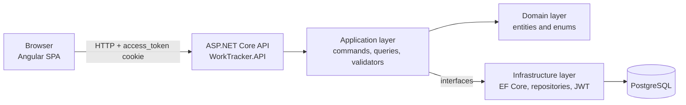
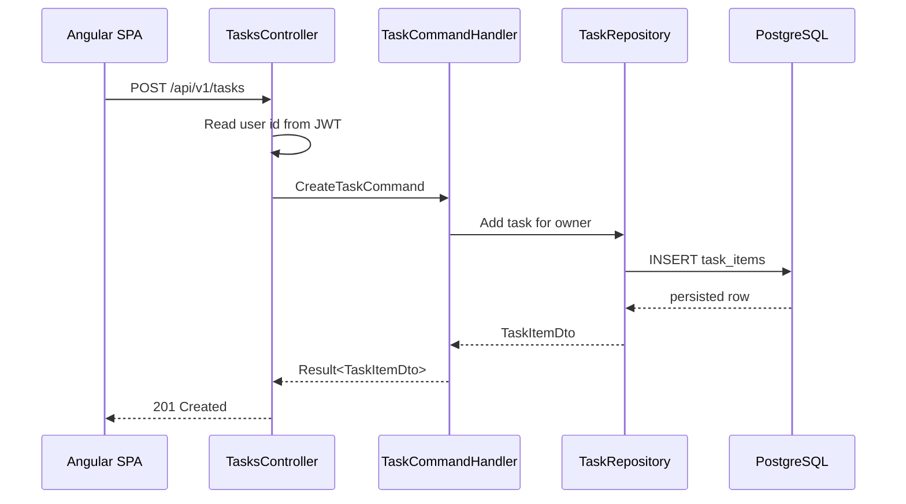

# Architecture

WorkTracker consists of an Angular application, an ASP.NET Core REST API, and a
PostgreSQL database. The backend is organized into Clean Architecture-style
layers, while the frontend uses standalone components, guards, interceptors, and
API services.

## High-level view



## Backend layers

| Layer | Project | Responsibility |
| --- | --- | --- |
| API | `backend/src/WorkTracker.API` | HTTP controllers, contracts, mappers, CORS, auth middleware, exception handling, OpenAPI, health checks. |
| Application | `backend/src/WorkTracker.Application` | Use cases, commands, queries, DTOs, validation, result objects, persistence/auth abstractions. |
| Domain | `backend/src/WorkTracker.Domain` | Core entities: `User`, `TaskItem`, task status and priority enums. |
| Infrastructure | `backend/src/WorkTracker.Infrastructure` | EF Core `DbContext`, repositories, migrations, JWT generation and authentication wiring. |

Dependency direction:

```text
API -> Application -> Domain
API -> Infrastructure -> Application
Infrastructure -> Domain
```

Application code depends on interfaces such as `ITaskRepository`,
`IUserRepository` and `IJwtGenerator`. Infrastructure provides the concrete
implementations.

## Frontend structure

| Area | Path | Responsibility |
| --- | --- | --- |
| App shell | `frontend/src/app/app.*` | Routes and root component. |
| Core auth | `frontend/src/app/core/auth` | Auth service/store, route guards, auth HTTP interceptor and unauthorized handler. |
| Core API | `frontend/src/app/core/api` | Central endpoint constants. |
| Auth feature | `frontend/src/app/features/auth` | Login and register pages. |
| Tasks feature | `frontend/src/app/features/tasks` | Tasks page, task forms, filtering, CRUD service. |
| Shared | `frontend/src/app/shared` | Shared error models and toast service. |

Frontend environment files define the API base URL:

- Development: `http://localhost:5088/api/`
- Production: `/api/`

## Authentication flow

1. Browser sends `POST /api/v1/auth/register` or `POST /api/v1/auth/login`.
2. API validates the request and creates or authenticates the user.
3. API generates a JWT and writes it to an `HttpOnly` cookie named
   `access_token`.
4. Angular sends later API calls with credentials enabled through HTTP
   interceptors.
5. ASP.NET JWT bearer authentication reads the token from the cookie.
6. Task endpoints use the JWT `sub` claim to scope reads and writes to the
   current user.

Cookie settings:

- `HttpOnly = true`
- `SameSite = Lax`
- `Secure = Request.IsHttps`
- expiration currently follows the login/register cookie options and JWT
  expiration configuration.

Forwarded headers are enabled so TLS-terminating reverse proxies can preserve
the original request scheme for secure cookie handling.

## Task flow



## Error handling

- Validation errors return `ValidationProblemDetails` with HTTP `400`.
- Expected domain/application failures are returned with `Problem(...)`.
- Unexpected exceptions are handled by `GlobalExceptionHandler`.
- API responses follow ASP.NET problem details conventions where possible.

## Health and OpenAPI

- Health endpoint: `GET /health`
- OpenAPI JSON in Development: `GET /openapi/v1.json`
- Swagger UI in Development: `GET /swagger`

## Infrastructure shape

Local development can run the API and frontend directly with PostgreSQL in a
container. Docker Compose builds API/web images and starts PostgreSQL plus a
one-shot migration container. Kubernetes uses a similar shape: Postgres
`StatefulSet`, migration `Job`, API and web `Deployment`, services and Ingress.
