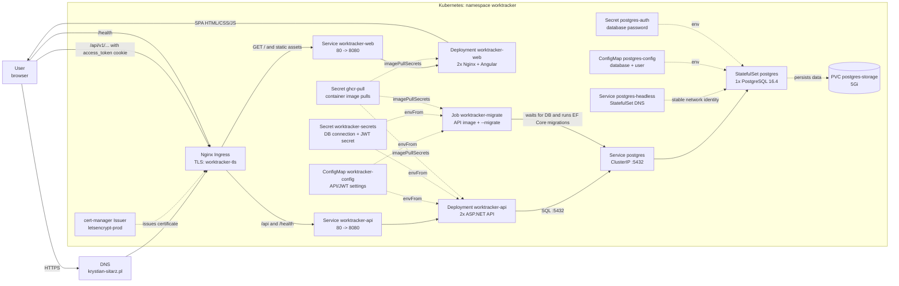

# Kubernetes data-flow diagram

Simple data-flow diagram for WorkTracker running in the `worktracker` namespace.

## Main paths

1. The browser opens `https://krystian-sitarz.pl` or `https://www.krystian-sitarz.pl`.
2. The TLS-terminating Ingress routes `/` to `worktracker-web`, where Nginx serves the built Angular application.
3. The frontend uses the production `apiBaseUrl: /api/`, so API calls return through the same Ingress.
4. The Ingress routes `/api` and `/health` to `worktracker-api`.
5. The API reads configuration and secrets from `worktracker-config` and `worktracker-secrets`, and persists data in PostgreSQL through the `postgres` Service.
6. `worktracker-migrate` is a one-shot Job that runs the API image with the `--migrate` argument; it waits for PostgreSQL readiness before running migrations.
7. PostgreSQL runs as a `StatefulSet` and stores data on the `postgres-storage` volume.

## Source manifests

- `k8s/60-ingress.yml`
- `k8s/50-web.yml`
- `k8s/40-api.yml`
- `k8s/30-migrate-job.yml`
- `k8s/20-postgres.yml`
- `k8s/10-config.yml`
- `k8s/15-issuer.yml`
